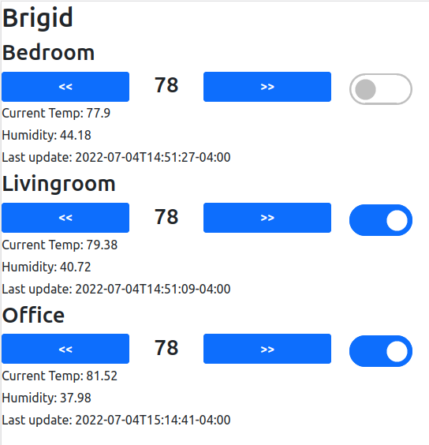

# Brigid
**An MQTT-based Thermal Control System**

## What is this and what is it good for?

This is a thermostat system that uses sensors and smart outlets to intelligently manage ambient temperature with a friendly web UI. 

## How does it work?

The main Flask app runs three threads: one for the Flask mechanism itself, a separate thread to read from MQTT and publish messages back out, and a third to manage the state of the system and issue commands when it wanders out of bounds. 

The state machine manages a series of zones which may potentially overlap. At each timestep, all of the sensors related to each outlet are evaluated as TOO_COLD (1), IN_RANGE (2) or TOO_HOT (3). If the minimum of all states for an AC is either TOO_COLD or IN_RANGE then the AC shuts off, TOO_HOT turns it on.

Additionally, a manual lockout switch is provided for each AC to prevent the state machine from modifying it.

## Why did you write it?

This was a project to teach myself MQTT, Flask, and a bit of frontend. I really enjoyed the [ThinkEco Modlet](https://web.archive.org/web/20201116144624/http://thinkecoinc.com/#smart-control) until the company ostensibly went out of business. Since all of its cloud dependencies went dead, I had no choice but to build my own.

## What technologies are involved?

In this repo I use
* [Flask](https://flask.palletsprojects.com/en/2.1.x/) web framework with [gunicorn](https://gunicorn.org/) WSGI server
* MQTT via the [Paho MQTT](https://pypi.org/project/paho-mqtt/) python client
* [Bootstrap](https://getbootstrap.com/docs/5.0/getting-started/introduction/) frontend framework for reactive mobile-friendly layouts
* [Docker](https://www.docker.com/) containers
* and of course [Python](https://www.python.org/) with [Threading](https://docs.python.org/3/library/threading.html).

Other things I use in my deployment include:
* [Nomad](https://www.nomadproject.io/) for container orchestration
* [ConBee II](https://phoscon.de/en/conbee to read Zigbee messages
* [Zigbee2MQTT](https://www.zigbee2mqtt.io/) to parse Zigbee messages into MQTT
* [Eclipse Mosquitto](https://mosquitto.org/) MQTT broker
* [Athom Tasmota US Plug V2](https://www.athom.tech/blank-1/tasmota-us-plug-v2) smart plugs
* [Aqara WSDCGQ11LM](https://www.aqara.com/us/temperature_humidity_sensor.html) temperature and humidity sensor

## Didn't you know Home Assistant is better at this?

Yes! That being said, the point of self-hosted projects like Home Assistant is to be in control of everything top-to-bottom and what better way to do that than to write our own?
